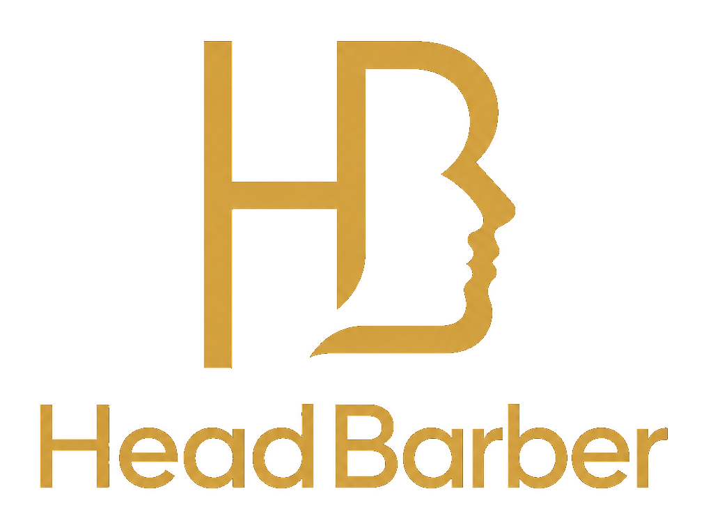

<div align="center">



# HeadBarber

### Gestão inteligente para barbearias.

Uma plataforma web desenvolvida para centralizar agendamentos, clientes, profissionais, serviços e informações operacionais de barbearias em um único ambiente.


**Status:** Em desenvolvimento

</div>

---

## 📌 Sobre o projeto

O **HeadBarber** é uma plataforma de gestão criada para facilitar a rotina de barbearias, profissionais e gestores.

A proposta do sistema é reduzir a dependência de processos manuais e concentrar as principais atividades da operação em uma única aplicação.

Por meio do HeadBarber, a barbearia pode organizar sua agenda, acompanhar reservas, cadastrar profissionais, gerenciar clientes, configurar serviços e visualizar informações financeiras relacionadas à operação.

O sistema também disponibiliza uma experiência de agendamento voltada ao cliente, permitindo que reservas sejam realizadas sem depender exclusivamente de atendimento manual.

---

## ✨ Principais funcionalidades

### 📅 Agenda e reservas

Gerenciamento dos atendimentos da barbearia através de uma agenda centralizada.

Entre os recursos estão:

* visualização dos horários;
* criação e gerenciamento de reservas;
* organização dos atendimentos por profissional;
* acompanhamento da rotina diária;
* integração com o fluxo de agendamento do cliente.

---

### 🔗 Agendamento online

Cada barbearia pode disponibilizar uma experiência própria de agendamento para seus clientes.

O fluxo permite selecionar informações como:

* profissional;
* serviço;
* adicionais disponíveis;
* data;
* horário.

O objetivo é tornar o processo de reserva mais rápido tanto para a barbearia quanto para o cliente.

---

### 💈 Gestão de profissionais

Área destinada ao gerenciamento dos barbeiros e profissionais vinculados à operação.

A plataforma permite centralizar informações necessárias para organização dos atendimentos e disponibilidade da equipe.

---

### 👥 Gestão de clientes

Centralização das informações relacionadas aos clientes da barbearia.

Isso facilita o acompanhamento dos atendimentos e reduz a necessidade de manter registros distribuídos em diferentes ferramentas.

---

### ✂️ Serviços e adicionais

Cadastro e gerenciamento dos serviços oferecidos pela barbearia.

Também é possível trabalhar com adicionais vinculados aos atendimentos, permitindo uma organização mais flexível do catálogo.

---

### 🛍️ Produtos

Área dedicada ao gerenciamento de produtos utilizados ou comercializados pela barbearia.

---

### 💳 Planos mensais

O sistema possui suporte ao gerenciamento de planos recorrentes oferecidos pela própria barbearia aos seus clientes.

---

### 📊 Gestão financeira

Área voltada para acompanhamento das informações financeiras da operação.

O objetivo é oferecer ao gestor uma visão mais clara do desempenho da barbearia sem precisar depender de controles externos para tarefas básicas do dia a dia.

---

### 🔐 Autenticação

O HeadBarber possui fluxo de autenticação e gerenciamento de acesso, incluindo:

* login;
* recuperação de senha;
* redefinição de senha;
* onboarding inicial;
* proteção de áreas autenticadas.

---

### 💳 Assinaturas da plataforma

O projeto possui infraestrutura para gerenciamento de assinaturas da própria plataforma, permitindo trabalhar com diferentes planos de acesso ao HeadBarber.

Informações sensíveis relacionadas aos serviços de pagamento são mantidas exclusivamente através de variáveis de ambiente e não fazem parte do código público.

---

## 🧰 Tecnologias

### Front-end

* **Next.js**
* **React**
* **TypeScript**
* **Tailwind CSS**
* **Lucide React**

### Back-end e dados

* **Next.js Server APIs**
* **Supabase**
* **PostgreSQL**
* **Supabase Auth**
* **Supabase SSR**

### Pagamentos

* **Stripe**

### Qualidade e testes

* **Vitest**
* **Playwright**
* **ESLint**

### Monitoramento

* **Vercel Analytics**
* **Vercel Speed Insights**

---

## 🏗️ Estrutura geral

```text
headBarber/
│
├── public/
│   └── brand/              # Identidade visual e assets públicos
│
├── src/
│   ├── app/
│   │   ├── api/            # Endpoints server-side
│   │   ├── auth/           # Fluxos de autenticação
│   │   ├── booking/        # Agendamento público
│   │   ├── dashboard/      # Área administrativa
│   │   ├── login/
│   │   ├── onboarding/
│   │   ├── plans/
│   │   └── subscription/
│   │
│   ├── components/         # Componentes reutilizáveis
│   ├── lib/                # Serviços e integrações
│   └── utils/              # Utilitários
│
├── supabase/
│   ├── migrations/         # Evolução versionada do banco
│   └── tests/
│
├── package.json
├── next.config.ts
└── README.md
```

A estrutura apresentada acima é propositalmente resumida e descreve apenas a organização geral do projeto.

---

## 🚀 Executando localmente

### Pré-requisitos

Antes de iniciar, tenha instalado:

* Node.js;
* npm;
* Git.

Também será necessário possuir as configurações dos serviços utilizados pelo projeto.

### 1. Clone o repositório

```bash
git clone https://github.com/VitorRBrumatti/headBarber.git
```

```bash
cd headBarber
```

### 2. Instale as dependências

```bash
npm install
```

### 3. Configure o ambiente

O projeto possui um arquivo:

```text
.env.example
```

Crie seu arquivo local a partir dele:

```bash
cp .env.example .env.local
```

No Windows PowerShell:

```powershell
Copy-Item .env.example .env.local
```

Preencha o `.env.local` utilizando **suas próprias credenciais de desenvolvimento**.

> Nunca utilize credenciais de produção em ambientes locais compartilhados e nunca envie arquivos `.env` para o Git.

### 4. Banco de dados

O versionamento da estrutura de dados utilizada pelo projeto está localizado em:

```text
supabase/migrations/
```

Configure um projeto Supabase próprio e aplique as migrations utilizando o ambiente apropriado.

### 5. Inicie a aplicação

```bash
npm run dev
```

A aplicação estará disponível, por padrão, em:

```text
http://localhost:3000
```

---

## 🧪 Testes

### Testes automatizados

```bash
npm test
```

### Testes End-to-End

```bash
npm run test:e2e
```

### Verificação de código

```bash
npm run lint
```

### Build de produção

```bash
npm run build
```

---

## 🔒 Segurança

Este repositório **não deve conter credenciais ou segredos de produção**.

Informações como:

* chaves privadas;
* tokens;
* segredos de webhooks;
* credenciais administrativas;
* credenciais de banco de dados;
* chaves de serviços externos;

devem ser armazenadas somente através de variáveis de ambiente ou dos mecanismos de secrets fornecidos pela infraestrutura de deploy.

O arquivo `.env.example` serve apenas como referência para configuração e não deve possuir credenciais reais.

Caso alguma credencial seja enviada acidentalmente para o Git, removê-la do arquivo **não é suficiente**: a credencial deve ser imediatamente revogada ou rotacionada.

---

## 🎨 Princípios de interface

O HeadBarber foi projetado priorizando uma interface:

* profissional;
* direta;
* organizada;
* responsiva;
* consistente;
* orientada à operação diária.

O objetivo é permitir que informações importantes possam ser compreendidas rapidamente, evitando excesso de elementos decorativos ou interfaces que prejudiquem a execução das tarefas.

A aplicação utiliza como referência boas práticas de acessibilidade, incluindo contraste adequado, navegação por teclado, estados visíveis e layouts adaptáveis para diferentes tamanhos de tela.

---

## 🗺️ Evolução do projeto

O HeadBarber continua em desenvolvimento e novas funcionalidades podem ser incorporadas conforme a evolução do produto.

Entre os principais objetivos do projeto estão:

* melhorar a automação da rotina das barbearias;
* reduzir tarefas administrativas repetitivas;
* simplificar o processo de agendamento;
* fornecer informações úteis aos gestores;
* melhorar a experiência do cliente;
* consolidar diferentes necessidades operacionais em uma única plataforma.

---

## ⚠️ Sobre este repositório

Este repositório representa o desenvolvimento do **HeadBarber** e pode conter funcionalidades ainda em evolução.

Configurações de produção, credenciais, regras administrativas sensíveis e informações privadas de infraestrutura não fazem parte desta documentação.

---

## 👨‍💻 Desenvolvedor

Desenvolvido por **Vitor R. Brumatti**.

Projeto criado como uma solução completa de software para gestão e digitalização da operação de barbearias.

---

## 📄 Licença

Atualmente este projeto não possui uma licença open-source definida.

O código-fonte é disponibilizado neste repositório para fins de desenvolvimento, demonstração e portfólio.

A ausência de uma licença open-source não concede automaticamente permissão para copiar, distribuir, modificar ou utilizar comercialmente o código.

---

<div align="center">

### HeadBarber

**Mais organização para a barbearia. Uma experiência melhor para o cliente.**

</div>
